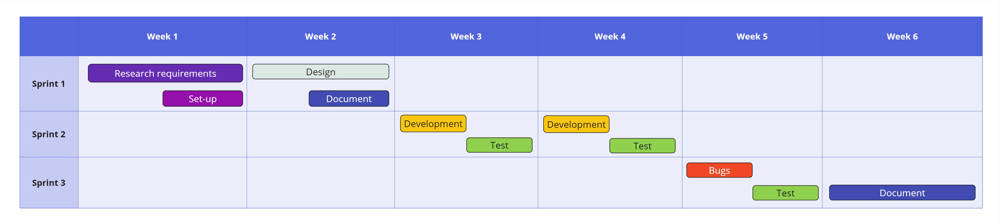
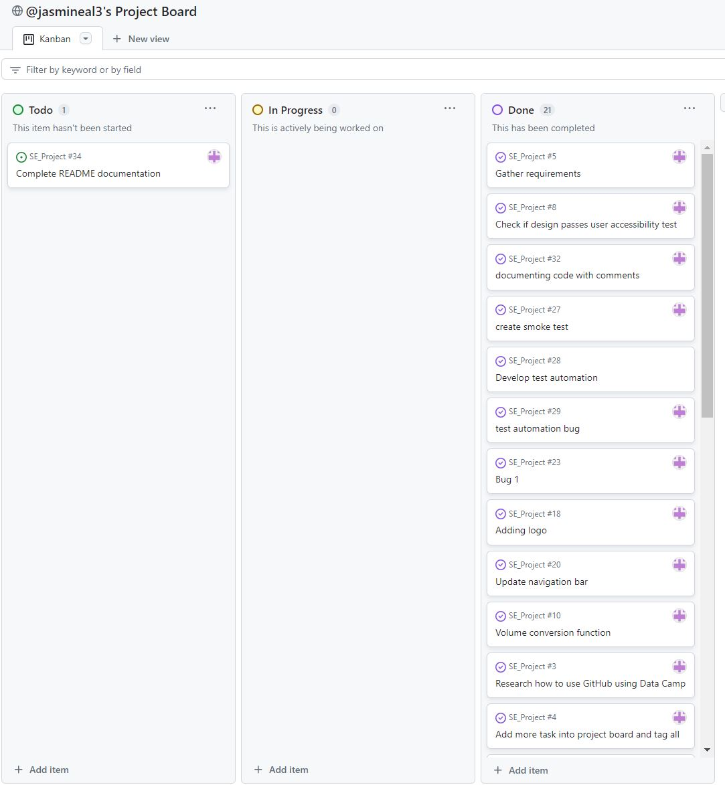
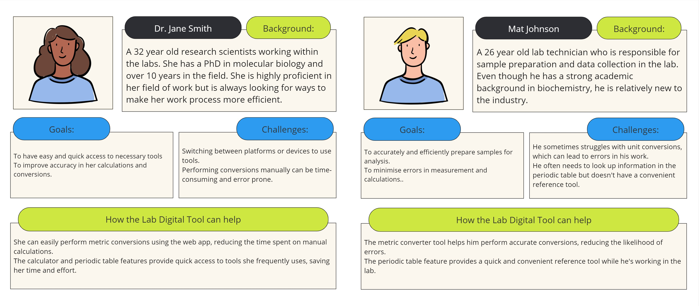
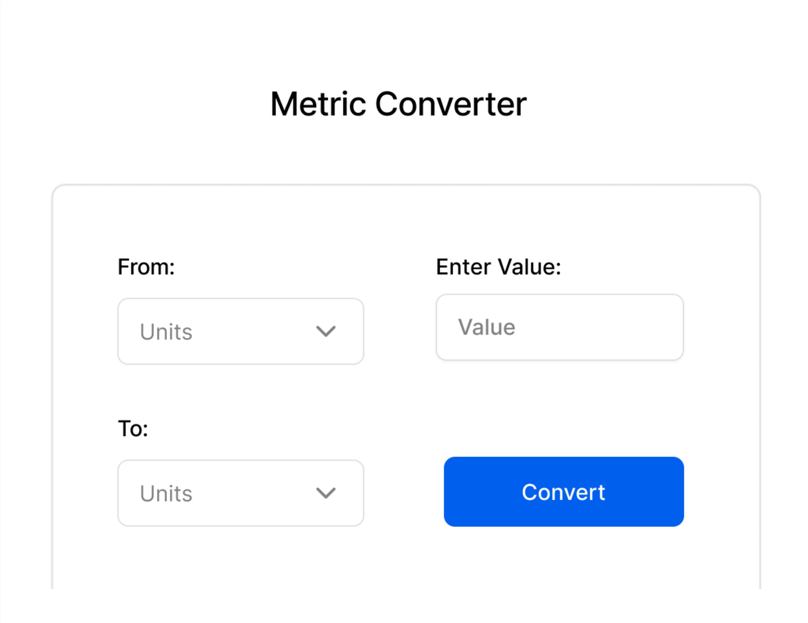
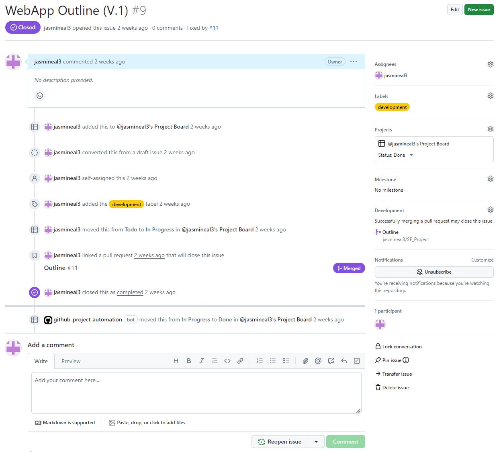
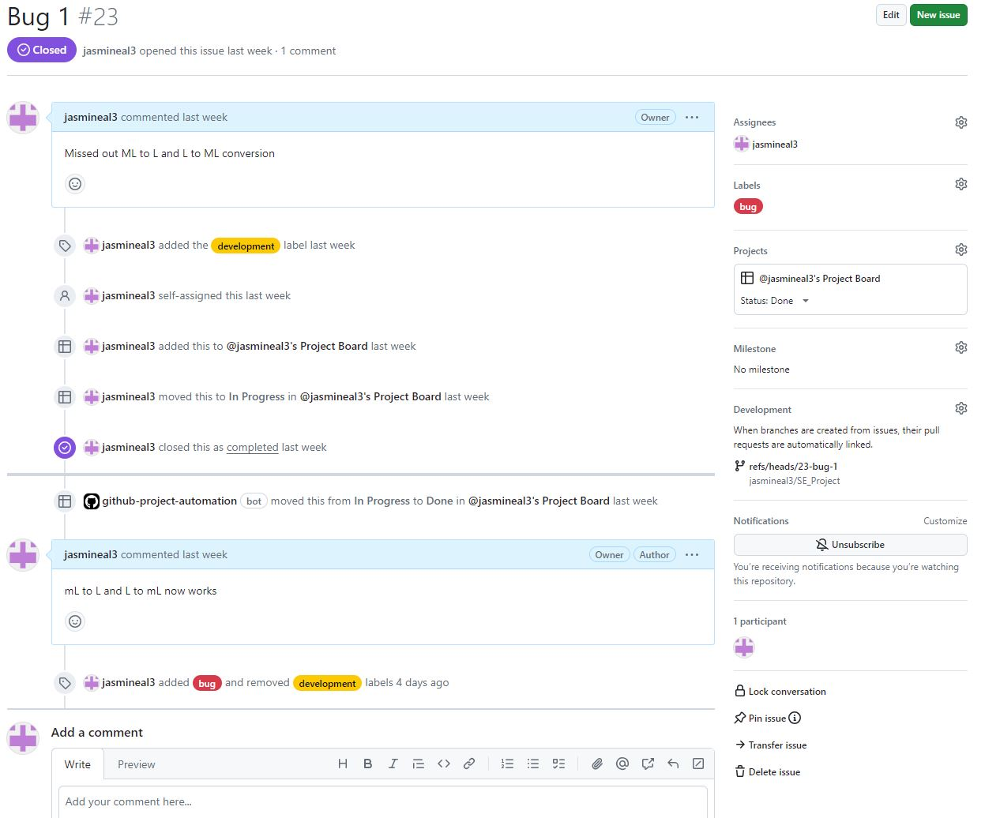
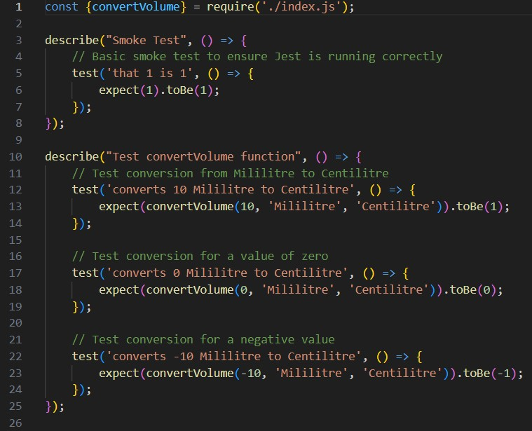

# 🧪 Lab Digitals Tools (Volume Metric Converter)🧪

## Contents 
<nav>
    <li><a href="#Introduction">Introduction</a>
    </li>
    <li><a href="#Project Plan">Project Plan</a>
    </li>
    <li><a href="Requirements">Requirements</a>
    </li>
    <li><a href="#Design">Design</a>
    </li>
    <li><a href="#Development">Development</a>
    </li>
    <li><a href="#Testing">Testing</a>
    </li>
    <li><a href="Documentation">Documentation</a>
    </li>
    <li><a href="Evaluation">Evaluation</a>
    </li>
</nav>

<body>

## Introduction
### Summary
The [Lab Digital Tools](https://jasmineal3.github.io/SE_Project/) is a web application designed primarily for scientists within the workplace to aid in their day-to-day lab work. The application includes multiple tools that scientists frequently use, such as a metric converter, a calculator, and a periodic table. These tools are essential in numerous scientific calculations and analyses therefore the end goal is to provide a centralised location where scientists can access these tools quickly and easily, thereby saving time and increasing their productivity.

### Project Description
The initial ‘launch’ phase releases the tool with a feature for a volume metric conversion. Currently, scientists switch between different platforms and devices to access these essential tools, making this process not only time-consuming but also disruptive to the workflow. To solve this problem, the proposed web application would house these tools in one place, accessible with just one click.

<<<<<<< HEAD
### Tech Stack
[GitHub Repository](https://github.com/jasmineal3/SE_Project) - Platform for software development. 
[HTML](https://www.w3schools.com/html/) – Structures web page. 
[CSS](https://www.w3schools.com/css/) – Styling and layout. 
[JavaScript](https://www.w3schools.com/js/) – Adding interactive functionality e.g. unit conversion. 
[JSON](https://www.json.org/json-en.html) – Testing. 
[YAML](https://yaml.org/) – Configures automation testing. 
[Git](https://git-scm.com/) – Version control of code files. 
[VS Code](https://code.visualstudio.com/) – Code editor. 
[GitHub projects](https://docs.github.com/issues/planning-and-tracking-with-projects/learning-about-projects/about-projects) – Project kanban board. 
[Figma](https://www.figma.com/) – Designing wireframes. 
[Miro](https://miro.com/app/) – Project mapping and user persona building.  
=======
### Tech Stack
[HTML](https://www.w3schools.com/html/) – Structures web page. 
[CSS](https://www.w3schools.com/css/) – Styling and layout. 
[JavaScript](https://www.w3schools.com/js/) – Adding interactive functionality e.g. unit conversion. 
[JSON](https://www.json.org/json-en.html) – Testing. 
[YAML](https://yaml.org/) – Configures automation testing. 
[Git](https://git-scm.com/) – Version control of code files. 
[VS Code](https://code.visualstudio.com/) – Code editor. 
[GitHub projects](https://docs.github.com/issues/planning-and-tracking-with-projects/learning-about-projects/about-projects) – Project kanban board. 
[Figma](https://www.figma.com/) – Designing wireframes. 
[Miro](https://miro.com/app/) – Project mapping and user persona building.  
>>>>>>> 6a512276bffae427d26f1479cbb1911bf25d20c8

## Project Plan
 

    
  <em>Figure 1 - Project Launch Phase Cycle</em>

<<<<<<< HEAD
### Agile Methodology
An [agile approach]() is adopted for the project delivery of Lab Digital Tools, which breaks down the project into iterative cycles so that continuous improvement and collaboration are executed. The project delivers a cycle over 6 weeks – illustrated in Figure 1 and created using Miro. This cycle’s goal was to deliver the Lab Digital Tool web app with a functioning feature for a volume metric conversion. The future cycles would see the release of the weight conversion then a calculator and periodic table feature.
  
The launch phase of a 6-week cycle adopted a [scrum methodology](https://www.scrum.org/resources/what-scrum-module) where 2-week sprints were timeboxed (shown in Figure 1), which involved iterations between requirements gathering, design, development, testing and documentation. At the end of the 6-week cycle, the web app rolls out to the users.

### Planning Tool
To track the project’s progress the planning tool within GitHub called GitHub Projects was used to create the [Lab Digital Tools project board](https://github.com/users/jasmineal3/projects/1). 
This visual kanban board is organised so that each label’s name and colour are coordinated with the project plan items. New issues are assigned to an individual and labelled for transparency and accountability. Each issue is automatically closed through either a pull request or adding comments. In Figure 2, the completed project board after the project is demonstrated.
 

    
  <em>Figure 2 - Project Board </em>

=======
### Agile Methodology
An [agile approach]() is adopted for the project delivery of Lab Digital Tools, which breaks down the project into iterative cycles so that continuous improvement and collaboration are executed. The project delivers a cycle over 6 weeks – illustrated in Figure 1 and created using Miro. This cycle’s goal was to deliver the Lab Digital Tool web app with a functioning feature for a volume metric conversion. The future cycles would see the release of the weight conversion then a calculator and periodic table feature.
  
The launch phase of a 6-week cycle adopted a [scrum methodology](https://www.scrum.org/resources/what-scrum-module) where 2-week sprints were timeboxed (shown in Figure 1), which involved iterations between requirements gathering, design, development, testing and documentation. At the end of the 6-week cycle, the web app rolls out to the users.

### Planning Tool
To track the project’s progress the planning tool within GitHub called GitHub Projects was used to create the [Lab Digital Tools project board](https://github.com/users/jasmineal3/projects/1). 
This visual kanban board is organised so that each label’s name and colour are coordinated with the project plan items. New issues are assigned to an individual and labelled for transparency and accountability. Each issue is automatically closed through either a pull request or adding comments. In Figure 2, the completed project board after the project is demonstrated
 

    
  <em>Figure 2 - Project Board </em>

>>>>>>> 6a512276bffae427d26f1479cbb1911bf25d20c8
## Requirements
### Users
To begin gathering requirements a [design thinking](https://www.interaction-design.org/literature/article/5-stages-in-the-design-thinking-process#:~:text=Design%20thinking%20is%20an%20iterative,%2C%20Ideate%2C%20Prototype%20and%20Test.) 
approach is taken to ensure the delivery of a well-rounded user experience. This ensures users are at the heart of each stage of the process. The primary users of this web application are the scientists across the workplace however the application can be beneficial to a wider audience, including researchers, students, and educators in the field of science, who frequently need to use these tools. 

### Empathise
To understand users’ needs during the empathise phase, [user personas](https://www.interaction-design.org/literature/article/personas-why-and-how-you-should-use-them#personas_in_design_thinking-0)
 were created using Miro, shown in Figure 3, to provide a guide for the design and development as they illustrate the range of wants and needs required for the target users. This helps make informed web app decisions as any frustrations and challenges are addressed during the iterations.
  

    
  <em>Figure 3 - User Personas </em>

### Functional Requirements
The user personas support the creation of the functional requirements, which outline the essential functionalities the web app must perform. It also provides a base criterion for testing to be carried out against. For Lab Digital Tools, five functional requirements have been addressed:
1.	The web app should provide a user-friendly, intuitive interface for inputting values and selecting units for conversion.
2.	Users should be able to select from various metric units for conversion, including millilitres, centilitres, and litres.
3.	The web app should accurately convert the input value of the selected unit to the chosen unit.
4.	The web app should display the conversion result in the unit that was chosen.
5.	The web app should handle invalid inputs gracefully, providing clear error messages.

### Non-functional Requirements
The non-functional requirements are qualities that the overall web app must satisfy so that testing can be passed against it. For Lab Digital Tools, four non-functional requirements have been listed:
1.	Performance: The app should perform conversions quickly and efficiently, with minimal delay.
2.	Usability: The app should be easy to use, even for those with minimal technical knowledge.
3.	Accessibility: The app should comply with accessibility standards, making it usable for people with disabilities.
4.	Responsiveness: The app should be responsive, meaning it should display well on a variety of devices and screen sizes.
 

## Design
### Ideate
After empathising and defining the user's needs and problems, the ideation phase means brainstorming various ideas and solutions from different perspectives. One method is called the [Crazy Eights](https://blog.prototypr.io/how-to-run-a-crazy-eights-workshop-60d0a67b29a), where you quickly sketch 8 designs in 8 minutes, which can be done using pen and paper. For the Lab Digital Tools, four rough designs were sketched on paper, which was then taken into Figma to prototype the [first design wireframe](https://www.figma.com/proto/Q8Hfv46vOuN7vrMxdPAr0a/SE_Project-Metric-Converter?t=d3zw4Jrz8uwCE85H-1) iteration seen in Figure 4.
 

    
  <em>Figure 4 - First Wireframe Design </em>

This led to the [final design wireframe](https://www.figma.com/proto/Q8Hfv46vOuN7vrMxdPAr0a/SE_Project-Metric-Converter?t=r48ymPJRBwLSFnpw-1)
, shown in Figure 5, where the scalability of future features was considered e.g., weight conversion functionality, calculator, and the periodic table. An area for the unit results was implemented, leading to a rearrangement of the units and input/output boxes. The convert button became larger to make it intuitive.
 

    
  <em>Figure 5 - First Wireframe Design</em>

 

## Development
### Prototype
The wireframes illustrated the design of the web app however to develop a functioning prototype a [Minimum Viable Product](https://www.agilealliance.org/glossary/mvp/) (MVP) must be developed. In the first development issue, an outline of the web app was coded with HTML and some CSS and JS. Beginning with minimal functionality means further enhancements and features can be added to the backlog and prioritised for the next release trains.   
The first step to conquer the MVP development issue, shown in Figure 6, is by using git to clone the GitHub project repository so that VS Code can be used. A separate branch is created from the main branch so that risks of affecting the main code can be mitigated such as a bug. This means that only once the code is reviewed by collaborators, the branch can be merged to the main code.  
Once the web app outline using HTML and some CSS and JS are ready, the commands git commit, and push ware used so that it appears on the GitHub repository as a pull request. Pull requests, allow collaborators to check the changes that have been pushed to the branch, who then review it by commenting, changing, and approving it. The pull request can then be initiated, which will close the issue and the branch is deleted. Every development issue goes through this process to ensure changes do not affect the main branch.

 

    
  <em>Figure 6 - Development Issue Example</em>

 

### Bugs
When a bug is identified through testing, an issue is raised in the [project board](https://github.com/users/jasmineal3/projects/1), an example is shown in Figure 7. The issue is tagged as a bug and a separate branch is created to isolate the changes. Then the repository is cloned to VS Code so that the bug can be located within the code and necessary adaptations can be implemented to fix the bug. Once, the bug is resolved and validated, the branch changes are committed and pushed to GitHub. A pull request can be initiated on GitHub so that collaborators can review the changes, suggest modifications, and approve the pull requests. This can initiate the merge of the pull request into the main branch, which then automatically marks the issue as completed and the branch can be closed.
 

    
  <em>Figure 7 - Bug Issue Example</em>

 

## Testing
### Test Driven Development
A test-driven development (TTD) approach through unit testing is adopted in this project to verify the code components, which output the conversion results. The [JEST](https://jestjs.io/) testing framework is used to execute these unit tests so that it is simple and quick to set-up. This TDD enabled the code to be improved, bug-free and working correctly. 
A smoke test as the first test ensures essential functionalities work so any issues and bugs are diagnosed early on. The unit tests included entering values that were positive, negative and zero for different unit conversions. A code snippet for a unit test is shown in Figure 8.
 

    
  <em>Figure 8 - Unit Test Code Snippet</em>

 

[GitHub Actions](https://docs.github.com/en/actions) is used to set up an automated testing pipeline so that testing is performed every time a pull request is made. This allows for [Continuous Integration / Continuous Development](https://about.gitlab.com/topics/ci-cd/) (CI/CD) best practices to be implemented into the software development cycles. The code snippet of the YAML file is shown in Figure 9.
 

    
  <em>Figure 9 - YAML File Code Snippet</em>

 

### Performance and Accessibility
The [Google Lighthouse](https://developer.chrome.com/docs/lighthouse/overview) tool was used to test two of the non-functional requirements listed at the beginning. This means it runs against the Lab Digital Tools webpage to check the quality of its performance and accessibility. It scored an outstanding 100 for performance and the accessibility scored highly with 94. It also provided feedback on details where the web page could improve for example the subtext colour did not have a sufficient contrast ratio with the background colour. The report can be seen in Figure 10 and the [full report here](doc_images/LighthouseReport.pdf).
 

    
  <em>Figure 10 - Lighthouse Report</em>

 

### Usability Testing
To carry out the usability testing, a System Usability Scale (SUS) survey was created using Google Forms: [SUS Survey for Lab Digital Tools](https://forms.gle/dWAEB4xKSMp21aKk7). In which, 9 users tried out the webpage and completed the 10 questions. The metrics were calculated using a Google spreadsheet: [SUS excel calculation](https://docs.google.com/spreadsheets/d/1YWt8bOSEGIYWv4ffs7SY71YRjXv13chqhbuaM4Hy86E/edit?usp=sharing) where the average SUS Score resulted in 91/100, shown in Figure 11. This showed high usability meeting one of the initial non-functional requirements set at the beginning.
 

    
  <em>Figure 11 - SUS Survey Calculations</em>

 

### Manual Testing
Manual testing is carried out throughout the development to ensure the functionality of the web page. Thos involved comparing the design to the developed web app and testing every button for its functionality. This helped to test the requirements that were not tested by the CI/CD pipeline, Lighthouse or SUS Survey for example the responsiveness to a variety of screens and devices was no tested. To test responsiveness manually on the webpage going into the ‘inspect’ developer tool’s view, allowed for different dimensions to be manually tested. The Lab Digital Tools adjusted to the different sizes of screens and device so that it was functioning however it was visually poor on small screens.
 

    
  <em>Figure 12 - Responsiveness Testing</em>

 

## Documentation
Documentation is vital for the maintenance and future of the web app - the types of documentation available for the Lab Digital Tools project involves: 
<ul>
<li>GitHub Project board – documents all types of issues from feature, bugs to tasks whether they have been completed or are upcoming in the backlog. Figure 2, shows the project board.</li>
<li>Code comments – provide clarity and context which help new developers to understand the previous code. Figure 13 demonstrates the commented code.</li>
<li>README file – provides an overview of the project.</li>
</ul>
 

    
  <em>Figure 13 - Code Snippet of Code Comments</em>

 

## Evaluation
### Challenges
One challenge faced was deciding a test strategy that covered all cases and functionalities, particularly for different conversion units. This was overcome by including positive, negative and zero values as well as setting up a rigorous test framework and automated pipeline.
### Future Improvements
Responsiveness of the webpage to different screens and devices is a priority for the next version of the web app. Through testing on small screens, it is not very user-friendly so ensuring the optimisation for other devices will enhance the user’s overall experience.
Additional features such as the expansion to weight conversion, calculator and periodic table. This could be through API integrations, but it will help fulfil all users’ needs and wants to have a tool for everything.
A robust user feedback system should be implemented into the web app to ensure a user-centric continuous improvement approach. This will be from collecting, analysing, and integrating user feedback to guide the future roadmap of the web tool.
Protecting the longevity of the web tool through improving the scalability and maintainability of the web app. It should be able to handle multiple users simultaneously and it should be regularly updated to ensure long-term success therefore facilitating more efficient and accurate lab work.

### Conclusion
The Lab Digital Tool web app is a valuable resource for workplace scientists by providing a central hub for essential tools.  Overall, the journey of developing and refining the Lab Digital Tool web app has highlighted the importance of user-centred design, robust functionality with testing, and continuous improvement. Future planned enhancements means the app is positioned to meet the diverse needs of its users and support high productivity in science.

</body>